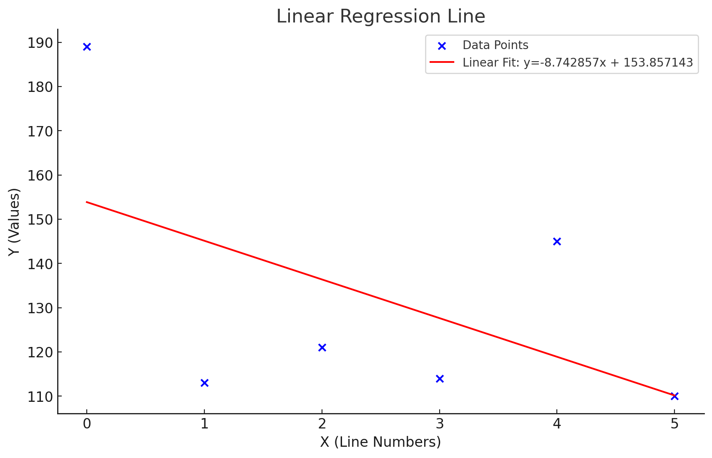
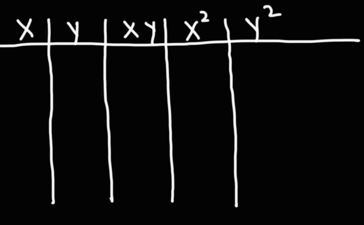

# Linear Stats

## Overview
Linear Stats is designed to analyze numerical datasets by computing key statistical measures. It aims to determine the relationship between sequential data points by calculating the Linear Regression Line and Pearson Correlation Coefficient, helping users understand trends and correlations in their data.

Linear Stats is a Go program that reads a file containing numerical data, calculates the Linear Regression Line and Pearson Correlation Coefficient, and prints the results in a specified format. The x-values are implicitly defined as the line numbers (starting from 0), and the y-values are the numbers read from the file.

# Linear Regression Line and Pearson Correlation Coefficient

### Linear Regression Line
The Linear Regression Line is a statistical method used to model the relationship between a dependent variable (y) and an independent variable (x). It helps in predicting values by fitting a straight line to the given data points. The equation for the linear regression line is given by:
````
y = mx + b
````
where:
`````
m is the slope of the line (rate of change of y with respect to x)

b is the y-intercept (the value of y when x = 0)
``````
### formular for calculating  Linear Regression:
The slope (m) and intercept (b) are calculated as:
```
m = n∑(XY)−∑X∑Y / n∑X2 - (∑X)2

b = ∑Y - m∑x / n

```
Based on the the given data points, graph shows a negative correlation.


### Pearson Correlation Coefficient

The Pearson Correlation Coefficient (r) is a measure of the strength and direction of the linear relationship between two variables. It ranges from -1 to 1:

- r = 1: Perfect positive correlation

- r = -1: Perfect negative correlation

- r = 0: No linear correlation

It is calculated using the formula:
```
r = (nΣxy - ΣxΣy) / sqrt((nΣx² - (Σx)²) * (nΣy² - (Σy)²))
```
### Example Correlation Coefficient Covalence Table



## Features
- Reads numerical data from a file
- Computes the Linear Regression Line (`y = mx + b`)
- Computes the Pearson Correlation Coefficient
- Outputs results in a well-formatted manner

## Installation
Ensure you have Go installed on your system. You can download it from [Go's official website](https://go.dev/dl/).

Clone the repository:
```sh
$ git clone https://learn.zone01kisumu.ke/git/oragwelr/linear-stats.git
$ cd linear-stats
```

## Usage
Run the program with the following command:
```sh
$ go run your-program.go <file_path>
```
Where `<file_path>` is the path to the text file containing the numerical data.

### Example
Given a file `data.txt` with the following content:
```
189
113
121
114
145
110
```
Run the program:
```sh
$ go run your-program.go data.txt
```
Expected output:
```
Linear Regression Line: y = <slope>x + <intercept>
Pearson Correlation Coefficient: <correlation>
```

## Formatting
- The slope and intercept values should have **6 decimal places**.
- The Pearson Correlation Coefficient should have **10 decimal places**.

## Dependencies
- The program uses Go's built-in `bufio`, `fmt`, `math`, `os`, and `strconv` packages.

## Contributing
1. Fork the repository.
2. Create a new branch (`feature-branch`).
3. Commit your changes.
4. Push to the branch and create a pull request.

## License
This project is licensed under the MIT License.

## Author
[oragwelr](https://learn.zone01kisumu.ke/git/oragwelr/)
